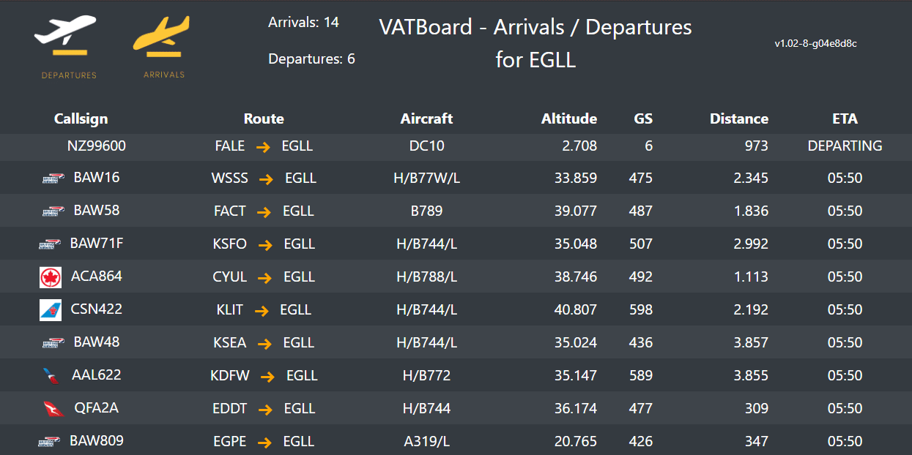

# flights
[](https://codecov.io/gh/guil95/flights)
[](https://github.com/guil95/flights/actions/workflows/app.yml)


This API is designed to calculate the route with the flights list provided.

# Running the App

To run the application, follow these steps:
1. Clone the repository to your local machine.
2. Open the terminal and navigate to the root directory of the project.
3. Run the following command to start the application:
   ```shell
   go run cmd/main.go
   ```
4. The server will start and the application will be ready to accept requests on `localhost:8080`.

# Making a Request

To make a request to the API, use the following `curl` command:
```shell
curl --request POST \
  --url http://localhost:8080/calculate \
  --header 'Content-Type: application/json' \
  --data '{
	"flights": [["IND", "EWR"], ["SFO", "ATL"], ["GSO", "IND"], ["ATL", "GSO"]],
	"route": [["SFO", "EWR"]]
}'
```
The above command will make a POST request to the `calculate` endpoint of the API running on `http://localhost:8080`. The request body should be a JSON object with two keys: `flights` and `route`. The `flights` key should have an array of flight lists in the format `["from_airport_code", "to_airport_code"]`, and the `route` key should have an array of two airport codes in the format `["origin_airport_code", "destination_airport_code"]`.

The API will respond with a JSON object containing the calculated route and the total cost of the trip.